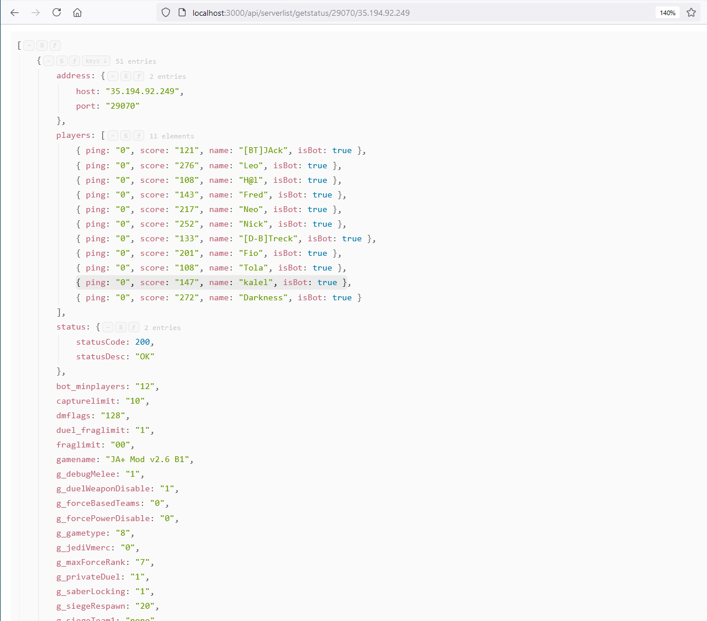

# Server-Status
Rest API for JK Series Games

**INFORMATION**
  * Valid queries: getinfo or getstatus
  * **your_site/api/serverlist/your_query**: Pings all servers in the list with your query
  * **your_site/api/serverlist/your_query/server_port/server_host**: Sends query to the server
  * **your_site/api/addserver/server_port/server_host**: Adds a server to the server list
  * **your_site/api/removeserver/server_port/server_host**: Removes a server from the server list
    
    _Example: localhost:3000/api/serverlist/getstatus/29070/255.168.0.1_
