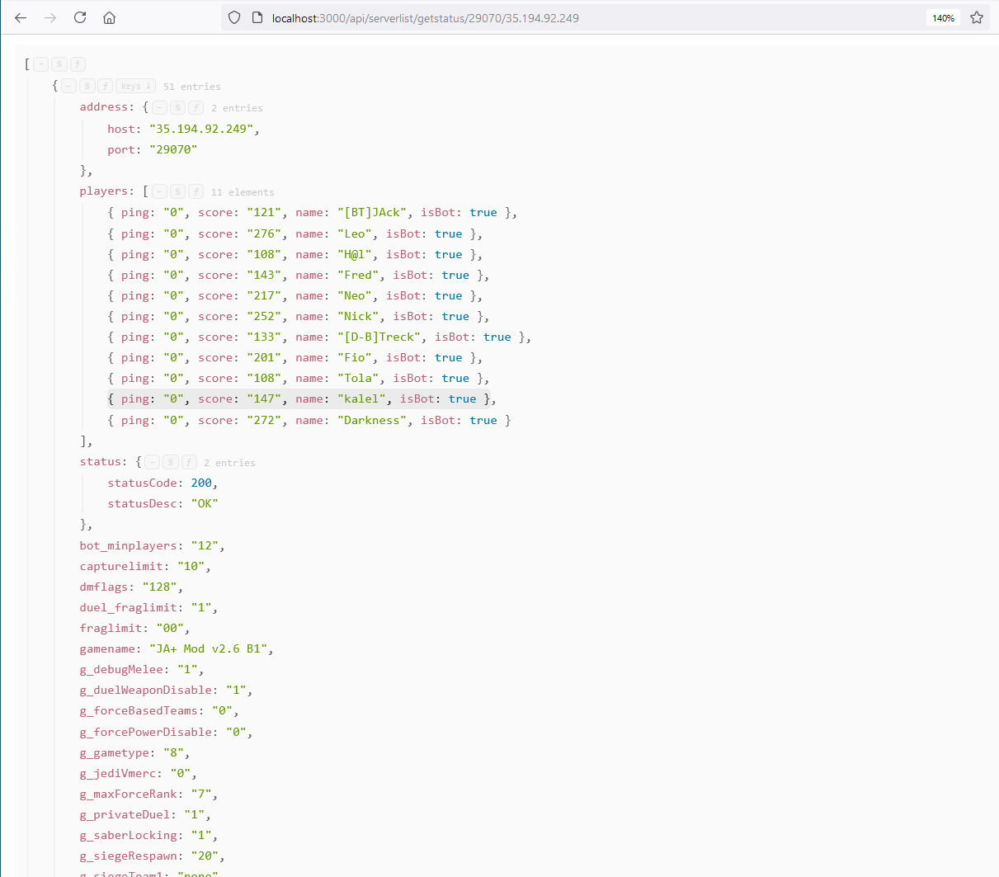

**TODO**
   - Proccess logging through winston
 

**Requirements:**
   - Install node
   - Run command "npm install" to install all required packages.
   - Command "node ./dst/index.js" will start the server
 

**Path variables**
   - :cmd: Should either be 'getstatus' or 'getinfo'
   - :host: IP of the server that is being queried
   - :port: Port of the server that is being queried
 

**Paths**
   - /api/serverlist/:cmd
      - Will return all server responses from the servers in ./serverlist/servers.json
   - /api/serverlist/:cmd/:port/:host
      - Will return status or info response from the server
   - /api/addserver/:port/:host
      - Will add the server (if the server is valid) to ./serverlist/servers.json
   - /api/removeserver/:port/:host
      - Will remove the server from ./serverlist/servers.json
